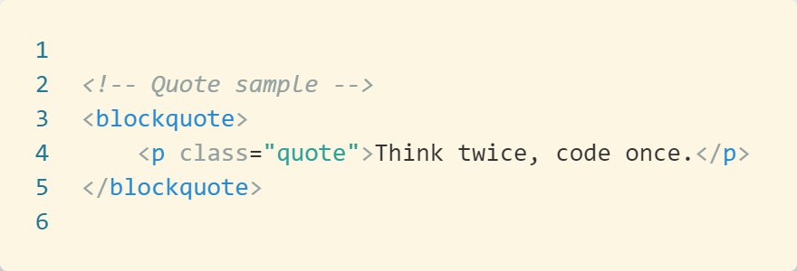
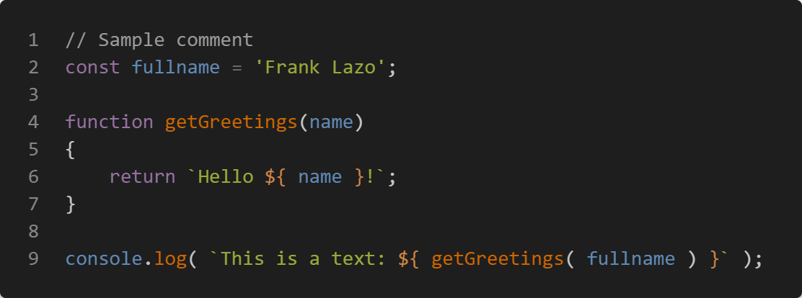
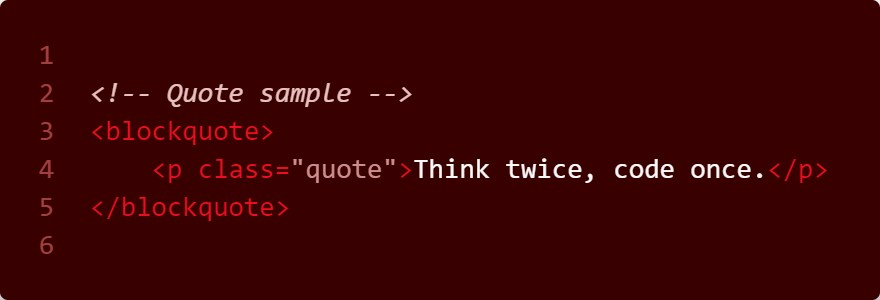
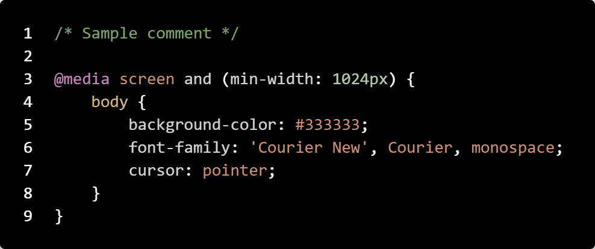
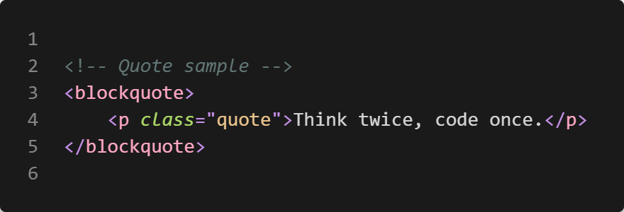

# VS Code: Temas

## Index

- [Nativos](#section-1)
    1. [Light Themes](#section-1-1)
    1. [Dark Themes](#section-1-2)
    1. [High Contrast Themes](#section-1-3)
- [Extensiones](#section-2)

[Title page][Index]

---

## Nativos

### Light themes

Light (Visual Studio) / Light+ (default light)

---
Quiet Light

---
Solarized Light

---

### Dark themes

Abyss

---
Dark (Visual Studio) / Dark+ (default dark)

---
Kimbie Dark

---
Monokai

---
Monokai Dimmed

---
Red

---
Solarized Dark

---
Tomorrow Night Blue

---

### High Contrast themes

High Contrast

[Title page][Index] - [Page top][Header]

---

## Extensiones

Andromeda

---
Atom Material Theme

---
Atom One Dark Theme

---
Community Material Theme Darker

---
Dracula Soft

---
Eva Light Bold

---
Eva Dark

---
Material Theme Darker

---
Night Owl (No Italics)

---
Overnight Slumber

---
Overreacted Darkness

---
Noctis Lux

---
Noctis Bordo

---
Noctis Minimus

---
Nord Wave

---
Palenight Theme

---
SynthWave '84

---
Gruvbox Material Light

---
Gruvbox Material Dark

[Title page][Index] - [Page top][Header]

[Index]: index.md
[Header]: #header